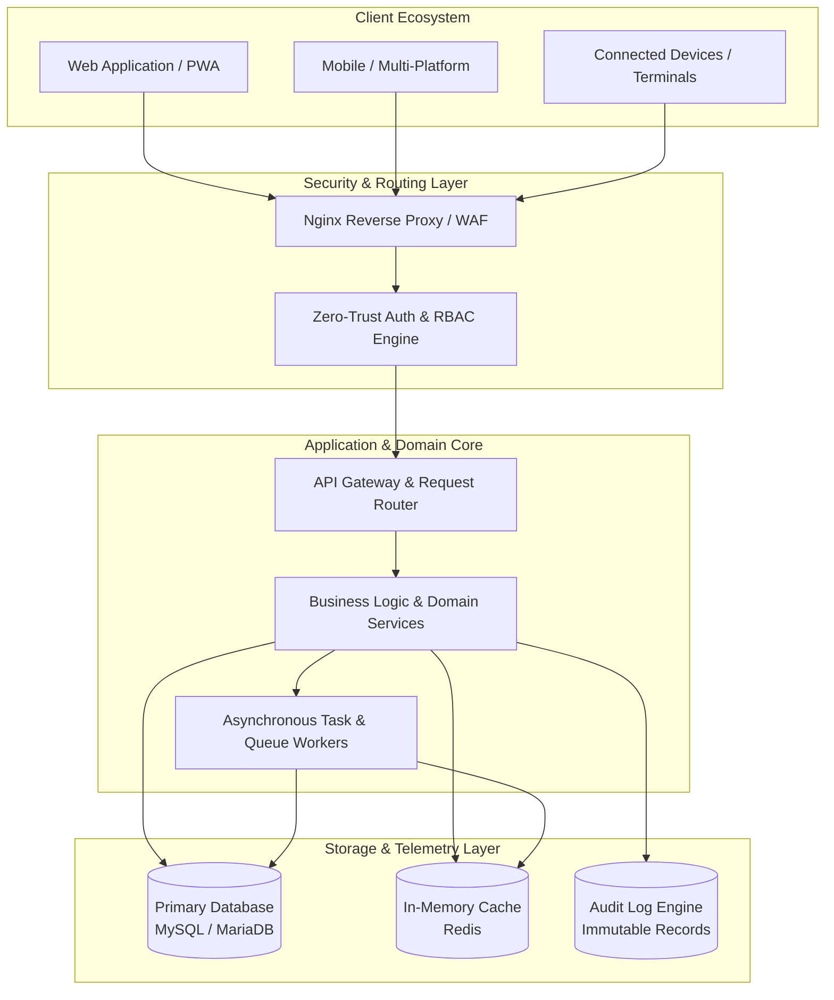

<div align="center">

  <!-- Hero Header Banner -->
  

  <!-- Animated Typing Line -->
  <a href="https://github.com/VEXONCODE404">
    
  </a>

  <br/><br/>

  <!-- Status Badges -->
  <p align="center">
    <a href="https://github.com/VEXONCODE404"></a>
    &nbsp;
    
    &nbsp;
    
    &nbsp;
    
  </p>

</div>

---

## ⚡ Engineering Profile

Software Engineer and Systems Architect focused on the end-to-end design, development, and scaling of robust digital platforms, multi-tenant enterprise architectures, and distributed web services. 

Specialized in full-stack system design, high-concurrency API engineering, database schema optimization, multi-platform development, and hardened security controls. Dedicated to transforming complex domain requirements into resilient, clean-coded, and production-grade software engines.

---

## 🧩 Engineering DNA

<div align="center">

| Core Principle | Engineering Execution |
| :--- | :--- |
| **Clean Architecture & DDD** | Strict separation of domain entities, business logic, interfaces, and infrastructure layers. |
| **API-First & Microservices** | Contract-driven RESTful architectures, event messaging, and low-latency payload serialization. |
| **Secure-by-Design** | Multi-factor authentication (MFA), granular role-based access control (RBAC), and rigorous audit trails. |
| **High Availability & Scale** | Asynchronous task workers, distributed Redis caching, and connection pooling. |
| **Data Integrity & Consistency**| ACID-compliant relational schemas, optimized indexing, and robust transaction boundaries. |

</div>

---

## 🛠️ Technology Stack

<div align="center">

### Backend & Core Systems
<p>
  
  
  
  
  
  
</p>

### Frontend & Multi-Platform
<p>
  
  
  
  
  
  
</p>

### Databases, Storage & Caching
<p>
  
  
  
  
  
</p>

### Infrastructure, Cloud & DevOps
<p>
  
  
  
  
  
  
</p>

</div>

---

## 🏗️ Selected Engineering Systems

### `01` — Competition Intelligence Engine
* **System Type:** High-Concurrency Evaluation & Real-Time Scoring Platform
* **Engineering Focus:** Real-time event telemetry, automated candidate ranking, tamper-proof score validation, digital certificate generation pipelines.
* **Architecture:** Decoupled service layer backed by high-throughput cache and relational persistence.
* **Core Technologies:** `PHP / Laravel` · `Redis` · `MySQL` · `REST API` · `WebSockets`
* **Key Challenges:** Managing concurrent jury evaluations with zero state collision and instantaneous scorecard aggregation.
* **Engineering Outcome:** Resilient competition platform delivering sub-second real-time scoring and automated verifications.

---

### `02` — Enterprise Operations Platform
* **System Type:** Multi-Tenant Institutional Resource & Workflow Engine
* **Engineering Focus:** Granular access governance (RBAC), multi-tier approval workflows, transaction auditing, and institutional inventory lifecycle.
* **Architecture:** Modular monolith designed with clear domain boundaries for extensible service integration.
* **Core Technologies:** `Laravel` · `ASP.NET Core` · `MariaDB` · `Redis` · `Nginx`
* **Key Challenges:** Ensuring strict ACID compliance across complex distributed approval chains with comprehensive audit logging.
* **Engineering Outcome:** Centralized operational platform streamlining organizational logistics and resource governance.

---

### `03` — Intelligent Guidance Engine
* **System Type:** Algorithmic Assessment & Profiling Platform
* **Engineering Focus:** Multi-dimensional skill profiling, automated recommendation heuristics, dynamic assessment builders, and interactive data visualization.
* **Architecture:** Event-driven evaluation engine with asynchronous background scoring pipelines.
* **Core Technologies:** `Full-Stack Engine` · `JavaScript` · `REST Services` · `PWA`
* **Key Challenges:** Delivering adaptive assessment workflows while maintaining responsive client performance on constrained networks.
* **Engineering Outcome:** Intelligent decision-support platform providing instant analytical scoring and tailored progression paths.

---

### `04` — Residential Operations Platform
* **System Type:** Facility, Access Control & Occupancy Management Ecosystem
* **Engineering Focus:** Resident identity verification, smart badge integration, real-time occupancy monitoring, and automated capacity scheduling.
* **Architecture:** Hybrid service model with multi-platform desktop clients synchronizing with centralized cloud endpoints.
* **Core Technologies:** `C# / .NET` · `MySQL` · `Security Policies` · `Desktop & Web Core`
* **Key Challenges:** Maintaining high data consistency across distributed check-in terminals and real-time ledger updates.
* **Engineering Outcome:** Unified occupancy management system with automated identity validation and real-time reporting.

---

### `05` — Digital Learning Ecosystem
* **System Type:** High-Load Competency & Digital Content Platform
* **Engineering Focus:** Scalable course delivery, milestone verification tracks, learner progress analytics, and responsive assessment engines.
* **Architecture:** Layered microservice modules with distributed CDN asset handling and session state isolation.
* **Core Technologies:** `PHP / Web Engines` · `PWA Architecture` · `MySQL` · `API Hub`
* **Key Challenges:** Scaling concurrent interactive evaluation sessions while minimizing database contention during peak activity.
* **Engineering Outcome:** High-availability learning environment supporting seamless continuous skill validation.

---

### `06` — Connected Systems & Streaming Lab
* **System Type:** IoT Telemetry Hub & Media Delivery Infrastructure
* **Engineering Focus:** Low-latency bi-directional sensor streaming, hardware telemetry ingestion, media broadcasting, and automated event triggers.
* **Architecture:** WebSocket telemetry gateway coupled with an optimized HLS streaming distribution layer.
* **Core Technologies:** `WebSockets` · `IoT Protocols` · `Nginx RTMP/HLS` · `Linux Daemons`
* **Key Challenges:** Synchronizing continuous high-frequency telemetry packets with minimal latency overhead and packet loss.
* **Engineering Outcome:** Stable IoT communication hub providing real-time data visualization and broadcast capabilities.

---

## 🧬 Architecture Mindset



---

## 🔐 Security Engineering

* **Identity & Access Governance:** Implementation of fine-grained Role-Based Access Control (RBAC), multi-factor authentication (MFA), and secure session management.
* **Defensive API Architecture:** Strict input sanitization, parameterized querying to eliminate SQL injections, rate-limiting, and hardened Cross-Origin Resource Sharing (CORS) rules.
* **Auditability & Forensics:** Immutable transaction tracking, secure audit logging of administrative events, and timestamped state mutations.
* **Security Headers & Transport:** Comprehensive Content Security Policy (CSP), Strict-Transport-Security (HSTS), and end-to-end TLS encryption.

---

## ⚙️ Performance Engineering

* **Query & Index Optimization:** Schema indexing, query execution plan analysis, and elimination of N+1 overhead via eager loading.
* **Multi-Tier Caching:** Strategic Redis caching for session stores, high-traffic lookups, and calculated aggregate metrics.
* **Asynchronous Processing:** Offloading computationally intensive tasks, report generation, and notifications to background queue workers.
* **Server Tuning:** Tailored Nginx buffer configurations, PHP-FPM pool optimization, and automated resource cleanup jobs.

---

## 🏆 Engineering Milestones

```
╔══════════════════════════════════════════════════════════════════════════════════╗
║  🥇 1ST PLACE WINNER — National Software Development & Engineering Hackathon    ║
║  📜 Certified Specialist — Multi-Platform Systems & Software Architecture        ║
║  ☁️ Cloud Architecture Competencies — Google Cloud • Huawei • Microsoft Ecosystem║
║  🚀 Technology Accelerator Alumnus — High-Impact Venture Innovation Programs     ║
╚══════════════════════════════════════════════════════════════════════════════════╝
```

---

## 📡 Current Focus

* **Distributed Cloud Systems:** Scaling microservice communication patterns and asynchronous event brokers.
* **High-Performance APIs:** Engineering ultra-low-latency backend endpoints and streaming architectures.
* **Enterprise Security Standards:** Hardening zero-trust identity pipelines and automated compliance auditing.
* **Modern Multi-Platform Architecture:** Building unified cross-platform solutions across web, desktop, and embedded interfaces.

---

## 🎯 Engineering Philosophy

> *"Build systems that remain understandable after they become complex."*

> *"Simplicity is an engineering advantage."*

---

## 🌐 Transmission & Connectivity

<div align="center">

  <p><b>Interested in collaborating on distributed systems, enterprise platforms, or system architecture?</b></p>

  <a href="https://github.com/VEXONCODE404">
    
  </a>
  &nbsp;
  <a href="https://github.com/VEXONCODE404?tab=repositories">
    
  </a>

</div>

<br/>

<div align="center">
  
</div>
