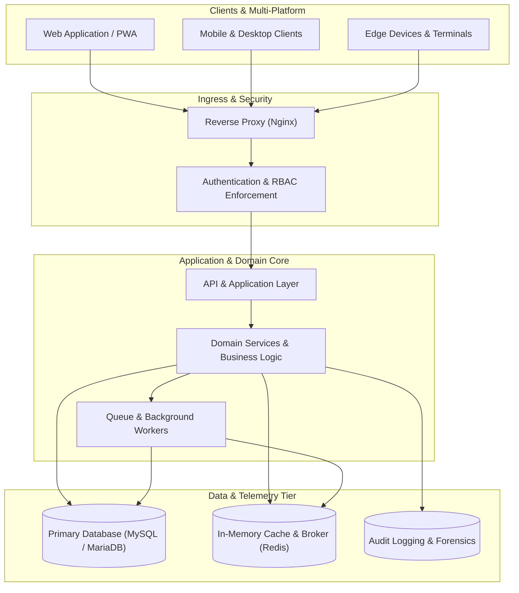

<div align="center">

  <!-- Header Banner -->
  

  <!-- Dynamic Typing Subtitle -->
  <a href="https://github.com/VEXONCODE404">
    
  </a>

  <br/><br/>

  <!-- Status Badges -->
  <p align="center">
    
    &nbsp;
    
    &nbsp;
    
    &nbsp;
    
  </p>

</div>

---

## ⚡ Profile Summary

Software Engineer and Systems Architect with a disciplined focus on building resilient backend services, scalable enterprise systems, and cross-platform applications. Experienced across end-to-end software lifecycles, full-stack architecture, relational and in-memory databases, API design, security governance, and Linux infrastructure. Dedicated to translating complex domain requirements into maintainable, well-structured, and high-performance digital solutions.

---

## 🧩 Engineering DNA

<div align="center">

| Domain | Core Stack & Methodologies |
| :--- | :--- |
| **Architecture** | Clean Architecture · SOLID · Domain Modeling · Modular Design |
| **Backend** | PHP · Laravel · C# · ASP.NET · Java |
| **Data & Storage** | MySQL · MariaDB · Redis · SQL · HFSQL |
| **Security** | RBAC · MFA · Session Security · Audit Logging · Input Sanitization |
| **Infrastructure** | Linux · Ubuntu Server · Nginx · PHP-FPM · CI/CD Automation |
| **Delivery** | REST APIs · WebSockets · PWA · Asynchronous Queues · Multi-Platform |

</div>

---

## 🛠️ Technology Stack

<div align="center">

### Backend
<p>
  
  
  
  
  
</p>

### Frontend & Multi-Platform
<p>
  
  
  
  
  
  
  
  
</p>

### Data, Cloud & Infrastructure
<p>
  
  
  
  
  
  
  
</p>

</div>

---

## 🏗️ Selected Engineering Systems

### `01` — Competition Intelligence Engine
* **Domain:** Evaluation & real-time workflow systems
* **Engineering Focus:** Scoring workflows, ranking pipelines, role-based operations, digital validation
* **Architecture:** Modular backend with asynchronous event processing and centralized persistence
* **Technology:** `Laravel` · `PHP` · `Redis` · `MySQL` · `REST APIs`
* **Problem Solved:** Coordinating concurrent evaluation workflows while preserving strict data consistency.

---

### `02` — Enterprise Operations Core
* **Domain:** Institutional resource & workflow management
* **Engineering Focus:** Granular authorization, multi-level approvals, audit trails, lifecycle tracking
* **Architecture:** Modular monolith designed with clear bounded contexts
* **Technology:** `Laravel` · `ASP.NET Core` · `MariaDB` · `Redis` · `Nginx`
* **Problem Solved:** Streamlining organizational logistics through structured, auditable execution paths.

---

### `03` — Intelligent Guidance Engine
* **Domain:** Assessment, profiling and recommendation systems
* **Engineering Focus:** Multi-criteria evaluation heuristics, dynamic profiling, responsive analytical reporting
* **Architecture:** Decoupled service engine with asynchronous scoring routines
* **Technology:** `Full-Stack Core` · `JavaScript` · `REST API` · `PWA`
* **Problem Solved:** Providing structured decision-support algorithms with responsive client visualization.

---

### `04` — Residential Operations Core
* **Domain:** Occupancy, accommodation and facility management
* **Engineering Focus:** Identity verification, access management, occupancy monitoring, scheduling
* **Architecture:** Synchronized multi-platform desktop client with centralized database endpoints
* **Technology:** `C#` · `.NET` · `MySQL` · `Security Policies`
* **Problem Solved:** Managing centralized occupancy ledgers and access control records across terminals.

---

### `05` — Digital Learning Ecosystem
* **Domain:** Learning, competency and digital content distribution
* **Engineering Focus:** Modular curricula structures, milestone tracking, learner progress analytics
* **Architecture:** Layered service model with optimized media delivery and session isolation
* **Technology:** `PHP` · `PWA Architecture` · `MySQL` · `REST Hub`
* **Problem Solved:** Delivering continuous digital courseware and verification tracks at scale.

---

### `06` — Connected Systems Lab
* **Domain:** IoT telemetry, real-time communication and media delivery
* **Engineering Focus:** Sensor ingestion pipelines, bi-directional telemetry streaming, streaming feeds
* **Architecture:** WebSocket messaging gateway paired with an optimized media server layer
* **Technology:** `WebSockets` · `IoT Protocols` · `Nginx RTMP/HLS` · `Linux Daemons`
* **Problem Solved:** Low-latency telemetry monitoring and continuous data feed broadcasting.

---

## 🧬 Reference Architecture



---

## 🔐 Security Engineering

* **Identity & Access Governance:** Role-Based Access Control (RBAC), multi-factor authentication (MFA), least privilege enforcement, and secure session rotation.
* **Defensive Application Design:** Strict input validation, parameterized queries, Cross-Origin Resource Sharing (CORS) hardening, and rate limiting.
* **Auditability & Integrity:** Immutable transaction records, administrative audit logging, and sensitive data protection.
* **Transport & Boundary Security:** Content Security Policy (CSP), HTTP Strict Transport Security (HSTS), and end-to-end TLS encryption.

---

## ⚙️ Performance Engineering

* **Database Optimization:** Strategic indexing, query plan analysis, and eager loading to prevent N+1 query patterns.
* **Caching Architecture:** Multi-tier Redis caching for session state, lookup tables, and frequently accessed datasets.
* **Asynchronous Offloading:** Background job queues for report generation, notifications, and heavy data transformations.
* **Runtime Tuning:** PHP-FPM pool optimization, static asset compression, and Nginx buffer configuration.

---

## 📡 Current Focus

```text
→ Enterprise Application Architecture
→ High-Performance Backend APIs
→ Secure-by-Design Software Engineering
→ Cloud & Linux Server Infrastructure
→ Multi-Platform Cross-Device Systems
→ AI-Assisted Engineering Workflows
```

---

## 🎯 Engineering Philosophy

> *"Design for clarity. Engineer for resilience."*

> *"Complexity should be managed, not celebrated."*

> *"Good architecture makes change cheaper."*

---

## 🌐 Transmission & Connectivity

<div align="center">

  <a href="https://github.com/VEXONCODE404">
    
  </a>
  &nbsp;
  <a href="https://github.com/VEXONCODE404?tab=repositories">
    
  </a>

</div>

<br/>

<div align="center">
  
</div>
