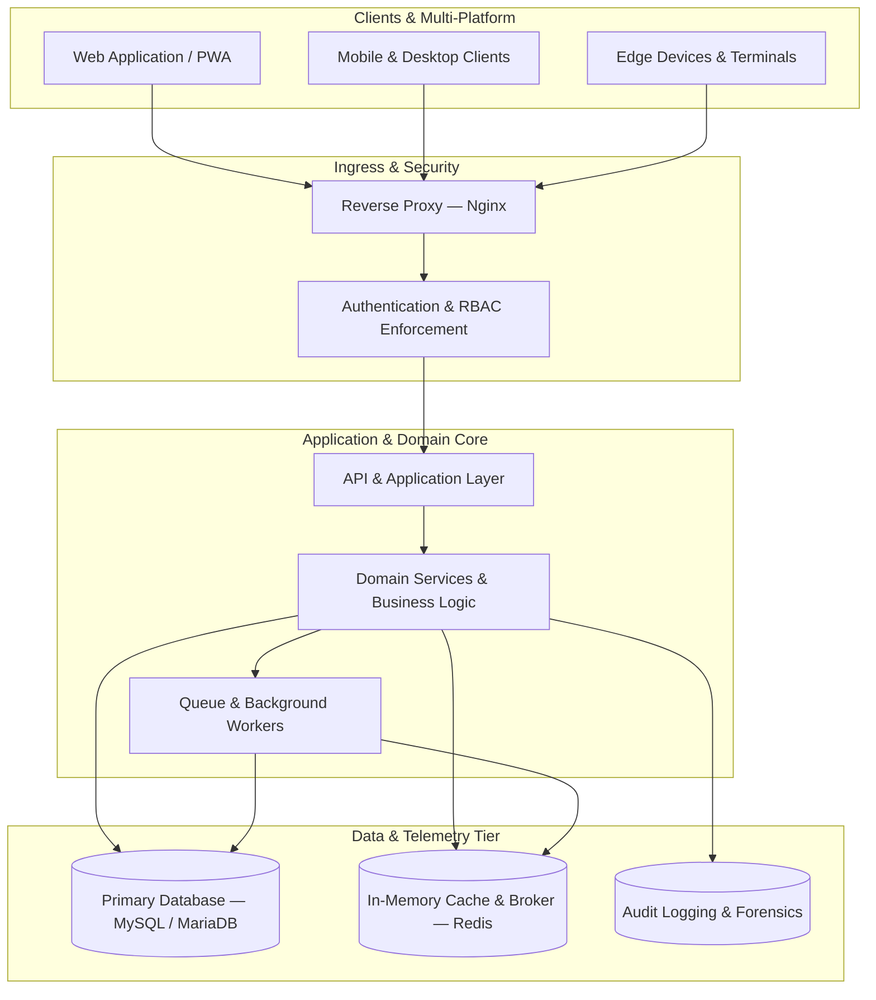

<div align="center">


<br/>


</div>

<br/>

## 🧭 Snapshot

<table width="100%">
<tr>
<td width="50%" valign="top">

**Focus areas**
- Backend architecture & API design
- Distributed / concurrent workflow systems
- Database performance & data modeling
- Application & infrastructure security
- Cross-platform delivery (web, desktop, mobile)

</td>
<td width="50%" valign="top">

**Working principles**
- Design decisions are documented, not assumed
- Every service is built to be observable
- Security and access control are load-bearing, not decorative
- Performance budgets are set before code is written
- Systems are built for the engineer who inherits them next

</td>
</tr>
</table>

---

## 🧱 Core Stack

<div align="center">

**Languages & Frameworks**
<p>


</p>

**Data & Caching**
<p>


</p>

**Interfaces & Delivery**
<p>


</p>

**Infrastructure & Tooling**
<p>


</p>

</div>

---

## ⚙️ Proficiency Map

<div align="center">

| Domain | Depth |
|:--|:--|
| Backend architecture & API design | ████████████████████░░ 90% |
| Relational database design & tuning | ███████████████████░░░ 85% |
| Security & access-control engineering | ██████████████████░░░░ 82% |
| Asynchronous / event-driven systems | █████████████████░░░░░ 78% |
| Linux server & deployment infrastructure | █████████████████░░░░░ 76% |
| Cross-platform client development | ███████████████░░░░░░░ 68% |

</div>

---

## 🏗️ Selected Engineering Systems

> المشاريع أدناه موصوفة بأسماء عامة تعكس نطاق العمل الهندسي فقط، دون الإشارة إلى أي اسم منتج أو عميل حقيقي.

<details open>
<summary><b>01 · Real-Time Evaluation Platform</b> — concurrent scoring & ranking workflows</summary>
<br/>

| | |
|---|---|
| **Domain** | Evaluation & real-time workflow systems |
| **Engineering focus** | Scoring pipelines, ranking logic, role-based operations, live validation |
| **Architecture** | Modular backend, event-driven processing, centralized persistence layer |
| **Stack** | `Laravel` `PHP` `Redis` `MySQL` `REST API` |
| **Core challenge solved** | Keeping concurrent evaluation sessions consistent under simultaneous writes without locking the whole dataset |

</details>

<details>
<summary><b>02 · Enterprise Resource & Workflow Suite</b> — multi-level approvals with full audit trails</summary>
<br/>

| | |
|---|---|
| **Domain** | Institutional resource & workflow management |
| **Engineering focus** | Granular authorization, multi-step approval chains, lifecycle & audit tracking |
| **Architecture** | Modular monolith with clearly bounded contexts |
| **Stack** | `Laravel` `ASP.NET Core` `MariaDB` `Redis` `Nginx` |
| **Core challenge solved** | Making every state change traceable and reversible without slowing down day-to-day operations |

</details>

<details>
<summary><b>03 · Adaptive Recommendation Engine</b> — multi-criteria profiling & scoring</summary>
<br/>

| | |
|---|---|
| **Domain** | Assessment, profiling and recommendation systems |
| **Engineering focus** | Multi-criteria evaluation heuristics, dynamic profiling, live analytical reporting |
| **Architecture** | Decoupled service engine with asynchronous scoring routines |
| **Stack** | `JavaScript` `REST API` `PWA` |
| **Core challenge solved** | Delivering explainable, criteria-weighted recommendations with sub-second client feedback |

</details>

<details>
<summary><b>04 · Facility Access & Occupancy System</b> — identity, access, and scheduling control</summary>
<br/>

| | |
|---|---|
| **Domain** | Occupancy, accommodation and facility management |
| **Engineering focus** | Identity verification, access control, occupancy monitoring, scheduling |
| **Architecture** | Synchronized multi-terminal desktop clients against a centralized database |
| **Stack** | `C#` `.NET` `MySQL` `Security Policies` |
| **Core challenge solved** | Keeping access records consistent across many concurrent terminals in real time |

</details>

<details>
<summary><b>05 · Digital Learning & Content Platform</b> — courseware delivery at scale</summary>
<br/>

| | |
|---|---|
| **Domain** | Learning, competency and digital content distribution |
| **Engineering focus** | Modular curricula, milestone tracking, learner progress analytics |
| **Architecture** | Layered service model with optimized media delivery and session isolation |
| **Stack** | `PHP` `PWA` `MySQL` `REST API` |
| **Core challenge solved** | Serving media-heavy courseware reliably to a large, concurrent learner base |

</details>

<details>
<summary><b>06 · IoT Telemetry & Streaming Gateway</b> — low-latency sensor & media pipelines</summary>
<br/>

| | |
|---|---|
| **Domain** | IoT telemetry, real-time communication and media delivery |
| **Engineering focus** | Sensor ingestion pipelines, bi-directional streaming, live feed distribution |
| **Architecture** | WebSocket messaging gateway paired with an optimized media server layer |
| **Stack** | `WebSockets` `IoT Protocols` `Nginx RTMP/HLS` `Linux Daemons` |
| **Core challenge solved** | Keeping telemetry latency low while broadcasting continuous data feeds to many clients |

</details>

---

## 🧬 Reference Architecture



---

## 🔐 Security Engineering

<table>
<tr><td width="28%"><b>Identity & Access</b></td><td>RBAC, multi-factor authentication, least-privilege enforcement, secure session rotation</td></tr>
<tr><td><b>Defensive Design</b></td><td>Strict input validation, parameterized queries, CORS hardening, rate limiting</td></tr>
<tr><td><b>Auditability</b></td><td>Immutable transaction records, administrative audit logging, sensitive-data protection</td></tr>
<tr><td><b>Transport Security</b></td><td>CSP, HSTS, end-to-end TLS encryption</td></tr>
</table>

---

## ⚡ Performance Engineering

<table>
<tr><td width="28%"><b>Database</b></td><td>Strategic indexing, query plan analysis, eager loading to prevent N+1 patterns</td></tr>
<tr><td><b>Caching</b></td><td>Multi-tier Redis caching for session state, lookups, and hot datasets</td></tr>
<tr><td><b>Async Offloading</b></td><td>Background queues for reports, notifications, and heavy transformations</td></tr>
<tr><td><b>Runtime Tuning</b></td><td>PHP-FPM pool tuning, asset compression, Nginx buffer configuration</td></tr>
</table>

---

## 🔄 How I Work

```
Discover  →  Design  →  Build  →  Harden  →  Ship  →  Observe
requirements  contracts   code    security   deploy   monitor
& constraints & data      & tests audit &     & docs   & iterate
              modeling            load test
```

---

## 📡 Currently Exploring

```text
→ Enterprise application architecture at scale
→ High-throughput backend API design
→ Zero-trust, secure-by-default engineering
→ Cloud-adjacent Linux infrastructure
→ Multi-platform, cross-device delivery
→ AI-assisted engineering workflows
```

---

## 🎯 Engineering Philosophy

> *"Design for clarity. Engineer for resilience."*
> *"Complexity should be managed, not celebrated."*
> *"Good architecture makes change cheap — and mistakes visible."*

---

<div align="center">

</div>
